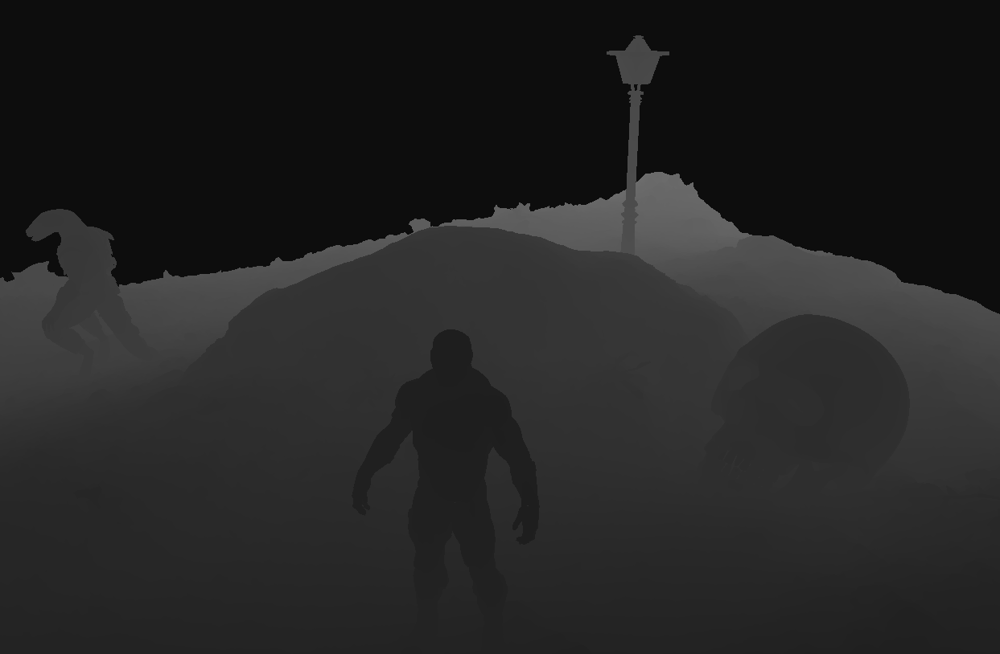
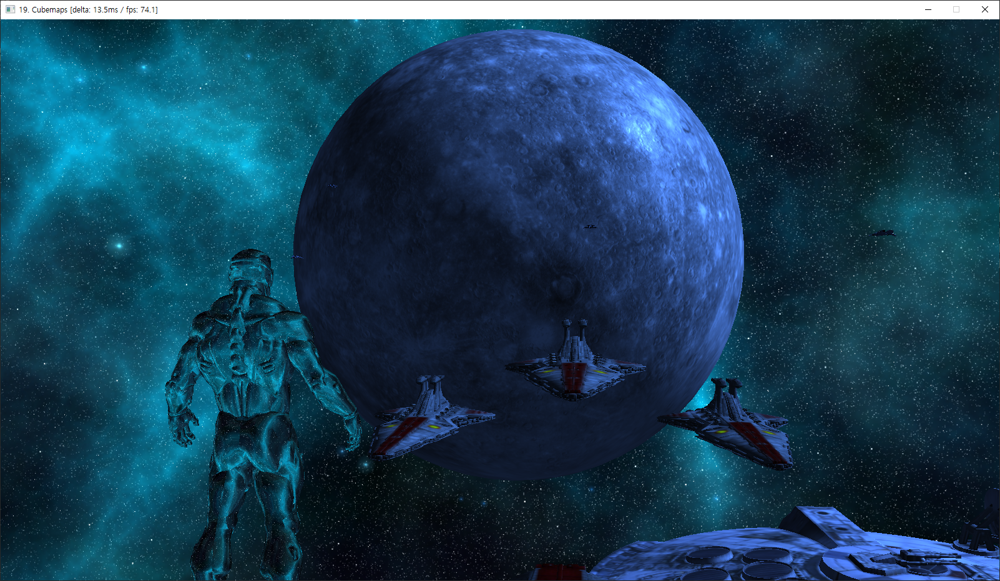
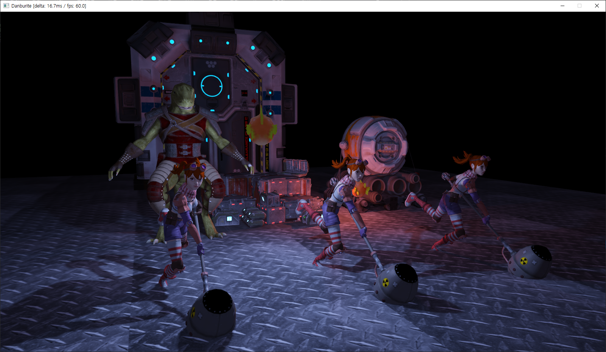

# Danburite
A real-time rendering engine built using core-profile OpenGL and C++.

### Abstract ###
Danburite is a rendering engine developed using core-profile OpenGL higher than 3.3 version and latest-standard-oriented C++. 
Its architecture is composed of three phases: ObjectGL(object-oriented OpenGL), rendering engine(Danburite), and client. Danburite uses ObjectGL to utilize OpenGL abstractly, and application developers use Danburite to make contents. Danburite provides simple and intuitive interfaces which help users develop applications quickly and easily.

### Source ###
Unfortunately, the source has not been completed yet. Development is currently underway and I would not prefer to release unfinished code. However I will release it as soon as a stable version is implemented.

### Features ###
- Blinn-Phong-based ordinary shading
- Silhouette shading (it feels like seeing an object in the fog)
- Alpha blending
- Postprocessing effect (It provides various filters like negative, grayscale, gaussian blur, edge detection, sharpen, etc.)
- Skybox
- Refraction/reflection shading
- Tessellation
- Multisample anti-aliasing
- Gamma correction
- Bindless texture
- Shadow
- Instancing
- Normal mapping
- Parallax mapping
- Advanced cpu-based shader compiler
- High dynamic range
- Skeletal animation (GPU skinning)

### Demo ###

<kbd>
 
(Click on the image above to play demo video)
</kbd>
